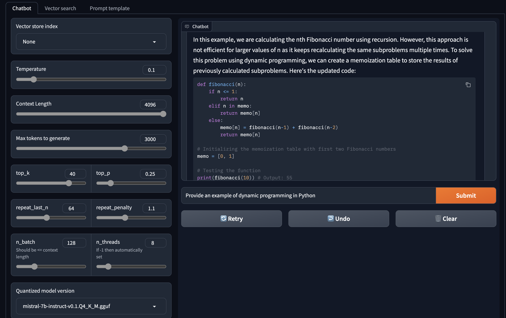

# CPU-only inferencing using a locally-deployed LLM

In this project, Cloudera uses [llama.cpp](https://github.com/ggerganov/llama.cpp) to employ a mistral-7b model for inferencing.
Our approach caters nicely to resource constrained environments that may only have CPUs or smaller GPUs with low VRAM and limited
threads. In the examples herein, we are deliberately only using CPUs for inferencing. llama.cpp facilitates this by supporting 4-bit 
integer quantization and mixed floating point precision. If GPUs are used, llama.cpp offers the flexibility of supporting NVIDIA and
CUDA, as well as Apple Silicon and Metal.This support extends also to AMD's ROCm library.

Please consider the detail below.

## Quantization
Quantization is the process of converting model weights from higher precision to lower precision floating point values.

## GGML and GGUF

In this project, Cloudera uses llama.cpp's newer GGUF format versus the older GGML.These formats enable you to fit an entire model within
RAM or VRAM.

GGML stands for Georgi Gerganov’s Machine Learning. The GGML format provided a way to encapsulate an entire model into a single file. 

Facebook released the Georgi Gerganov’s Unified Format (GGUF) in August of 2023 to overcome some of the limitations of the GGML format.
For example,new features can now be added to the format without breaking previous models.Also, tokenization now has better support for
special characters. Reportedly,there is also enhanced performance.

New versions of tokenizers > 0.13.3 should be used to support the GGUF format.

## Mistral
Cloudera remains agnostic to the model provider and can support a variety of locally-deployed and remotely-served models.For this project,
please note [Mistral]([https://mistral.ai/news/announcing-mistral-7b/). Its performance against LLaMA2 is compelling. Moreover,its 7 billion 
parameter benchmarks against other larger models using 13 billion parameters is noteworthy. As a transformer model for text generation, it 
uses sliding window attention and offers a large context length of 8,000 tokens. 

Most importantly, it demands low memory while offering decent throughput performance, low latency,and acceptable accuracy.

Please note that Cloudera does not provide benchmarking results to support these claims but enables you to derive your own experience via CML.

## Cloudera Machine Learning Documentation
For detailed instructions on how to run these scripts, see the [documentation](https://docs.cloudera.com/machine-learning/cloud/index.html).

# Example use cases

## Python code generation example


# Installing outside of CML (e.g. on your laptop or within an EC2)
## Manually clone the git repo
```
git clone https://github.com/kentontroy/cloudera_cml_llm_rag
```
## Untar the pre-created FAISS vector stores for RAG examples
```
tar xvzf vectorstore.tar.gz
```
## Download the model files
```
cd jobs

Change the path in download_models.py:
For example, "print(subprocess.run(["./download_models.sh"], shell=True))" instead of "print(subprocess.run(["/home/cdsw/jobs/download_models.sh"], shell=True))"

Change the path in download_models.sh to point the directory where you want the models to be stored:
wget -P ../models https://huggingface.co/TheBloke/Mistral-7B-v0.1-GGUF/resolve/main/mistral-7b-v0.1.Q4_K_M.gguf
wget -P ../models https://huggingface.co/TheBloke/Mistral-7B-Instruct-v0.1-GGUF/resolve/main/mistral-7b-instruct-v0.1.Q4_K_M.gguf

The above assumes that you executed: mkdir models in the top-level directory first.

Finally, run: 
python download_models.py
```
## Manually set the CDSW_APP_PORT where Gradio runs
```
Add an environment variable in .env that references a port of your choosing for CDSW_APP_PORT. Do not do this if you are running the Gradio application in CML as
CML will natively expose the same environment variable.

Wherever the model files are stored, change the LLM_MODEL_PATH entry in .env to point to the correct directory.
```
